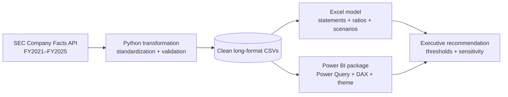
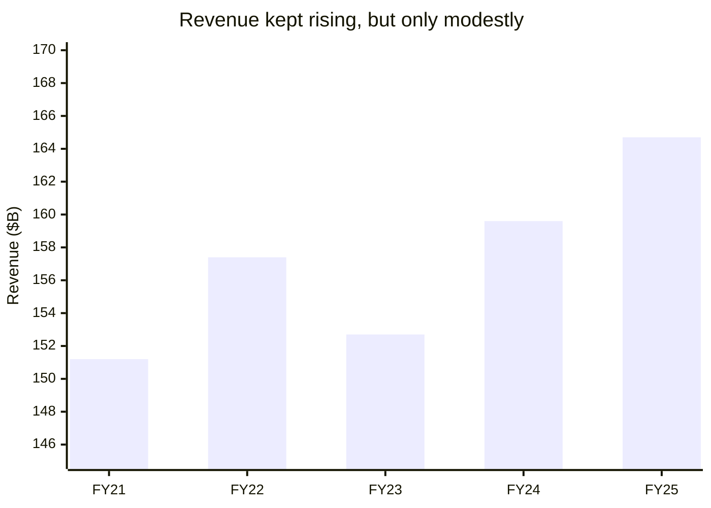
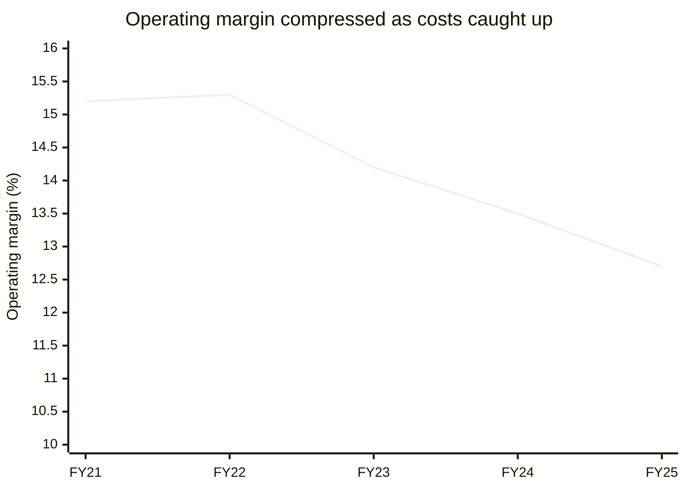

# Home Depot Financial Performance Analytics

**A graduate-level public-company financial analysis case study: SEC XBRL → Python → Excel → Power BI**

[](Project2_Home_Depot/scripts/transform_financials.py)
[](outputs/project2_home_depot/Home_Depot_Financial_Analysis.xlsx)
[](Project2_Home_Depot/power_bi/)
[](Project2_Home_Depot/scripts/transform_financials.py)

## Executive summary

This repository evaluates The Home Depot, Inc. across fiscal 2021–2025 and builds directional fiscal 2026–2028 downside, base, and upside cases. It is designed as a portfolio-quality demonstration of financial statement analysis, accounting judgment, data transformation, modeling controls, and executive reporting.

The headline conclusion is **hold / monitor execution**: Home Depot retains strong cash generation and attractive capital efficiency, but reported growth is increasingly acquisition-led while core operating margin and working-capital intensity require improvement. The model therefore ties the recommendation to explicit operating thresholds instead of relying on a single valuation claim.

## Analysis pipeline



The visual flow makes the model auditable: every dashboard insight traces back to a standardized dataset and an identifiable source layer.

## The story in two charts





**Human interpretation:** Home Depot is still getting bigger, but the incremental dollar of sales is producing less operating profit than it did five years ago. In plain English, this is a scale-and-execution story—not a liquidity crisis. The company can fund the business, but investors should want proof that acquired revenue becomes profitable and that inventory growth converts back into cash.

## Key findings

| Area | Evidence from the model | Interpretation |
|---|---:|---|
| Scale | Revenue increased from **$151.2B to $164.7B**; FY21–FY25 CAGR **2.2%** | Mature, resilient top line with modest organic momentum |
| Revenue quality | FY25 Other-segment revenue grew **$6.3B**, while Primary declined **$1.1B** | Acquisition contribution is material; core demand needs monitoring |
| Profitability | Operating margin declined from **15.2% to 12.7%** | Margin recovery is the central execution test |
| Cost structure | SG&A rose from **16.8% to 18.6% of sales** | Integration, labor, and operating leverage pressure profitability |
| Cash conversion | FY25 CFO **$16.3B**, CFO/net income **1.15x**, FCF **$12.6B** | Earnings remain supported by cash generation |
| Working capital | NOWC increased by approximately **$3.5B** from FY21 to FY25 | Capital is tied up in inventory and receivables relative to payables |
| Capital efficiency | Estimated FY25 ROIC **26.3%**, versus **49.7%** in FY21 | Still attractive, but the trend warrants disciplined reinvestment |

## Why this is resume-ready

This is not a static ratio table. It demonstrates an end-to-end analyst workflow:

- extracts multi-year financial facts from the SEC Company Facts API;
- standardizes income statement, balance sheet, cash-flow, segment, and category data;
- reconciles accounting identities and flags missing or non-comparable facts;
- calculates margins, liquidity, leverage, cash conversion, working capital, ROIC, and earnings-quality measures;
- separates acquisition-adjusted growth from the legacy Primary segment;
- translates assumptions into scenario forecasts and a two-driver sensitivity matrix;
- delivers an executive recommendation with decision thresholds and limitations.

## Repository contents

```text
├── Project2_Home_Depot/
│   ├── data/                  Clean long-format datasets and scenario outputs
│   ├── scripts/               SEC extraction, transformation, and workbook builder
│   ├── power_bi/              Power Query, DAX, layout guide, and theme
│   ├── Executive_Financial_Summary.md
│   └── Research_Methodology.md
├── outputs/project2_home_depot/
│   └── Home_Depot_Financial_Analysis.xlsx
├── requirements.txt
└── README.md
```

## Workbook and dashboard

The Excel model contains Dashboard, Assumptions, Statements, Ratios & WC, Advanced Analysis, Scenario Outlook, Sensitivity, Data, and Audit tabs. The Power BI package is refresh-ready: load `PowerBI_Refresh.pq`, add `PowerBI_Measures.dax`, apply `Home_Depot_Theme.json`, and save the resulting report as a `.pbix` file in Power BI Desktop.

## Reproduce the analysis

From the repository root:

```powershell
python -m pip install -r requirements.txt
python Project2_Home_Depot/scripts/transform_financials.py
node Project2_Home_Depot/scripts/build_workbook.mjs
```

The transformation uses SEC Company Facts data and writes standardized CSV outputs. The workbook builder consumes those outputs and regenerates the formula-driven analysis. All monetary values are presented in USD millions unless noted otherwise.

## Analytical design

- **Profitability:** revenue growth, gross margin, operating margin, net margin, SG&A intensity, NOPAT, ROA, and ROIC.
- **Liquidity and leverage:** current ratio, quick ratio, debt-to-equity, debt-to-assets, interest coverage, and cash-flow coverage.
- **Cash flow and earnings quality:** net income versus CFO, CFO/net income, FCF, accrual ratio, dividend coverage, capex/depreciation, and cash conversion.
- **Working capital:** inventory, receivables, payables, cash conversion cycle, and net operating working capital.
- **Forward view:** downside, base, and upside cases with revenue growth, operating-margin, capex, and working-capital assumptions; sensitivity to revenue CAGR and operating margin.

## Assumptions and limitations

ROIC is an analytical estimate using NOPAT divided by average invested capital; it is not management guidance. Acquisition-adjusted interpretation is directional because public filings do not provide a complete organic pro-forma bridge. SEC taxonomy labels and fiscal-year presentation can change, so the pipeline includes validation checks but still requires analyst review. The scenario model is not an investment recommendation, and the Power BI deliverable is intentionally provided as a reproducible build package rather than a binary `.pbix` file.

## Primary sources

- [SEC Company Facts API](https://data.sec.gov/api/xbrl/companyfacts/CIK0000354950.json)
- [Home Depot FY2025 Form 10-K](https://www.sec.gov/Archives/edgar/data/354950/000162828026019436/hd-20260201.htm)
- [Home Depot investor documents](https://ir.homedepot.com/investor-resources/investor-documents)

## Resume-ready project line

**Built a graduate-level Home Depot financial performance model using SEC XBRL, Python, Excel, and Power BI; standardized five years of statements, analyzed ROIC/working capital/earnings quality, isolated acquisition-adjusted growth, and produced audited scenario forecasts with executive decision thresholds.**

For the detailed recommendation, methodology, and audit notes, see [`Executive_Financial_Summary.md`](Project2_Home_Depot/Executive_Financial_Summary.md) and [`Research_Methodology.md`](Project2_Home_Depot/Research_Methodology.md).
